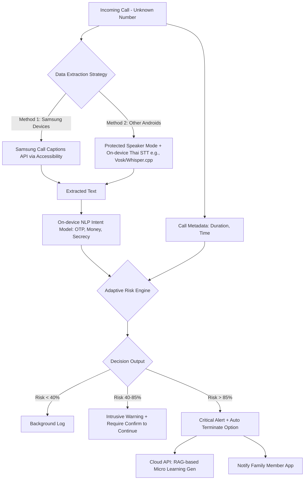

# VoiceGuard: Master Pitch Deck Assets
**เอกสารเตรียมข้อมูลสำหรับทำสไลด์นำเสนอ (Final Pitch Version - Technical & Legal Updated)**

---

## 1. "Why Now?" (ทำไมต้องทำเดี๋ยวนี้)
*   **The 40-Billion Baht Problem:** สถิติจากตำรวจไซเบอร์ (ปี 2566-2567) มีคดีหลอกลวงออนไลน์กว่า 3 แสนคดี **มูลค่าความเสียหายสูงถึง 3-4 หมื่นล้านบาท** และเป้าหมายหลักที่สูญเสียเงินต่อหัวสูงสุดคือ "ผู้สูงอายุ"
*   **Generative AI Weaponization:** แก๊งคอลเซ็นเตอร์เริ่มใช้ AI Voice Clone และ Automated Scripts ทำให้การหลอกลวงแนบเนียนขึ้นและขยายสเกลได้เร็วขึ้น
*   **Targeted Elder Exploitation:** ผู้สูงอายุชาวไทยมีอัตราการใช้สมาร์ทโฟนสูงขึ้นมาก (Digital Adoption) แต่ยังมี Digital Literacy ต่ำ ทำให้ตกเป็นเป้าหมายที่โจมตีง่ายที่สุด

---

## 2. System Architecture & Data Flow
*(แผนภาพแสดงการไหลของข้อมูลและ Adaptive Risk Engine)*

---

## 3. Q&A Defense: อุดช่องโหว่ Technical Feasibility

**Q1: Live Caption ของ Google ไม่รองรับภาษาไทย คุณจะดึง Text มาได้ยังไง?**
> **A:** MVP ของเราโฟกัสที่อุปกรณ์ Samsung Galaxy เป็นหลัก เนื่องจากฟีเจอร์ "Samsung Call Captions" รองรับภาษาไทยสมบูรณ์แบบ เราใช้ Accessibility Service ดึง Text ได้ ส่วนแบรนด์อื่น เราออกแบบ Fallback Pipeline ไว้ คือโหมด Speakerphone อัตโนมัติ รันโมเดล On-device Thai STT ขนาดเล็ก (เช่น Vosk หรือ Whisper.cpp แบบ Quantized) ซึ่งไม่ต้องใช้เน็ตครับ

**Q2: รัน NLP + RAG บนมือถือคนแก่ สเปกเครื่องจะรันไหวเหรอ?**
> **A:** จังหวะ Real-time Detection เราใช้ On-device NLP Model ขนาดเล็กมากเพื่อจับ Intent พื้นฐาน เครื่องสเปกต่ำก็รันไหว ไม่มีการใช้ RAG ในจังหวะนี้ ส่วน RAG (ดึงข่าวสแกมอัปเดต) เราเอาไปไว้ใน Post-call Micro-learning ตอนวางสายไปแล้ว ระบบจะต่อเน็ตส่งข้อมูลไปให้ Cloud API เจเนอเรตบทเรียนส่งกลับมาครับ

**Q3: ขอ Default Dialer บนมือถือคนแก่ UX ไม่พังเหรอ? เขาจะตั้งค่าเป็นเหรอ?**
> **A:** โมเดลธุรกิจของเราคือ "Child-deployed App" ครับ กลุ่มเป้าหมายคนติดตั้งคือคนทำงาน (ลูกหลาน) ที่กลับไปบ้านช่วงเทศกาล แล้วติดตั้งแอปพร้อมเซ็ต Default Dialer และผูกบัญชี Family ไว้ในเครื่องพ่อแม่รวดเดียวจบ เป็นการลด Adoption Barrier ครับ

**Q4: ถ้า AI ตัดสายผิด (เช่น หมอโทรมาฉุกเฉิน) ใครรับผิดชอบ?**
> **A:** ค่าเริ่มต้น (Default) จะไม่มีการ Auto-terminate ตัดสายทิ้งเองเด็ดขาด หากพบความเสี่ยงสูง ระบบจะใช้วิธี Intrusive Warning (หน้าจอแดง สั่นเตือน บล็อกเสียงคู่สนทนาชั่วคราว) และมีปุ่มใหญ่ๆ ให้ "วางสายเอง" ฟีเจอร์ Auto-terminate จะเป็นโหมด Opt-in ที่ต้องให้ลูกหลานยินยอมเปิดใช้ใน Setting เท่านั้นครับ

---

## 4. Legal & Compliance: Data Protection Impact Assessment (DPIA Snapshot)
*นี่คืออาวุธลับบนเวที หากกรรมการสายกฎหมายถามเรื่องการดักฟังหรือ PDPA เราจะกางสไลด์นี้โชว์ว่าเราประเมินความเสี่ยงมาแล้ว*

**ประเด็นที่ 1: การอัดเสียง/ดักฟังคู่สนทนา (Wiretapping & Privacy)**
*   **Grey Area:** กฎหมายไทยไม่มีระบุเรื่อง Two-party consent ชัดเจน แต่ศาลฎีกาเคยวางหลักว่าการแอบบันทึกเสียงกระทบสิทธิส่วนบุคคล
*   **Mitigation (การลดความเสี่ยง):** เราออกแบบให้ระบบประมวลผลแบบ **Transient Processing (ประมวลผลชั่วขณะ)** แปลงเสียงเป็น Text และลบทิ้งจาก RAM ทันที *ไม่มีการบันทึกหรือเขียนไฟล์เสียง (Audio File) ลงในหน่วยความจำถาวรใดๆ* ทั้งสิ้น 

**ประเด็นที่ 2: PDPA (ข้อมูลส่วนบุคคลของสแกมเมอร์)**
*   **Grey Area:** เสียงหรือข้อความสนทนาที่ถูกแปลงมา แม้จะเป็นของสแกมเมอร์ ก็ถือเป็นข้อมูลส่วนบุคคลตามนิยาม PDPA
*   **Mitigation (การลดความเสี่ยง):** ฐานทางกฎหมายในการประมวลผลคือ **Legitimate Interest (ฐานประโยชน์อันชอบธรรม)** เพื่อป้องกันอาชญากรรมทางการเงิน และระบบของเราทำการประมวลผลแบบ **On-device 100%** ข้อมูล Text จะไม่ถูกส่งขึ้น Cloud เด็ดขาด ข้อมูลเดียวที่ส่งกลับมาคือ "Log แบบ Anonymous" (เช่น Timestamp และ Risk Score)

**ประเด็นที่ 3: พ.ร.บ.คอมพิวเตอร์ มาตรา 15 (ความรับผิดของผู้ให้บริการ)**
*   **Mitigation (การลดความเสี่ยง):** ระบบออกแบบให้เป็นเพียง "เครื่องมือเตือนภัย" (Warning Tool) เราไม่มีศูนย์กลางเซิร์ฟเวอร์ที่เก็บข้อมูลการโทรของประชาชน จึงไม่เข้าข่ายผู้ให้บริการที่ควบคุมข้อมูลการสื่อสารโดยตรง

*(**ข้อความปิดท้ายตอน Pitch:** "ทางทีมตระหนักดีว่าเทคโนโลยีนี้อยู่บนเส้นด้ายทางกฎหมาย (Grey Area) ดังนั้นหลังจากผ่านช่วง Hackathon แผนงานแรกสุดของเราก่อนทำ MVP คือการนำ DPIA ฉบับเต็มเข้าไปปรึกษาผู้เชี่ยวชาญด้าน Cyber Law และ PDPA เพื่อให้มั่นใจว่า Architecture ของเราถูกต้องตามกฎหมาย 100%")*

---

## 5. Competitor Matrix (ตารางเปรียบเทียบคู่แข่ง)

| ฟีเจอร์ / ผลิตภัณฑ์ | VoiceGuard | Truecaller / Whoscall | Google Call Screen | Status Quo (ไม่ติดตั้งแอป) |
| :--- | :--- | :--- | :--- | :--- |
| **แนวทางการป้องกัน** | **Proactive (Content-based)** ตรวจจากเนื้อหาที่คุย | **Reactive (Blacklist)** ตรวจจากฐานข้อมูลเบอร์โทร | **Assistant (Pre-screening)** บอทรับสายแทนเพื่อถามจุดประสงค์ | ไม่มี (อาศัยสติผู้สูงอายุ) |
| **จังหวะการช่วยเหลือ** | **ระหว่างสนทนา (During Call)** | ก่อนรับสาย (Before Call) | ก่อนรับสาย (Before Call) | โดนล้างสมองเต็มรูปแบบ |
| **จุดเน้น (Focus)** | สแกมหลอกโอนเงินแบบเจาะจง | จัดการสแปมทั่วไป | จัดการสายเรียกเข้าทั่วไป | ความเสี่ยงสูงสุด 100% |
| **ความเหมาะสมกับคนแก่** | **สูง (ลูกหลานตั้งค่าให้ ทำงานเบื้องหลัง)** | ปานกลาง (ต้องอ่านหน้าจอ) | ต่ำ (คนแก่มักสับสนกับบอท) | รับสายเบอร์แปลกทุกสาย |

---

## 6. Startup KPIs (ตัวชี้วัดความสำเร็จ 6 เดือนแรก)
เราวัดประสิทธิภาพของโมเดลเป็นหลัก:
1.  **Detection Precision:** เป้าหมาย Precision >85% (ลด False Positive ให้เหลือน้อยที่สุดสำหรับ MVP)
2.  **Average Warning Time:** ระยะเวลาตั้งแต่รับสายจนถึง AI แจ้งเตือน (เป้าหมาย: ภายใน 30 วินาทีแรก)
3.  **User Trust Score / Opt-out Rate:** อัตราการลบแอปทิ้งหลังใช้งาน 30 วัน
4.  **Daily Protected Calls:** จำนวนสายแปลกหน้าที่ระบบประเมินความเสี่ยงต่อวัน

---

## 7. Defensibility & The Moat (ทำไมบริษัทใหญ่ถึงลอกยาก)
ทำไม Google ถึงทำแบบเราไม่ได้ใน 6 เดือน?
1.  **Thai Scam Intent Dataset:** เราครอบครองและเทรนโมเดลด้วยบริบทคำหลอกลวงของไทยโดยเฉพาะ (อ้างตำรวจไทย, พัสดุไทย) ซึ่ง Google Global Model เข้าไม่ถึง Deep context นี้
2.  **Insurance Partnership (B2B2C):** โอกาสเชื่อมระบบกับบริษัทประกัน (OIC) ออกโปรดักต์ "ประกันไซเบอร์ผู้สูงอายุ" สร้าง Lock-in effect ทางธุรกิจ
3.  **Family Trust Network:** แพลตฟอร์มเราผูกบัญชีผู้ใช้เข้ากับลูกหลาน เกิด Network Effect ภายในครอบครัวที่แอป Call screen ทั่วไปไม่มี

*(Appendix: Micro-learning ข้อมูลให้ความรู้จะถูกแทรกไว้หลังจบการโทร)*
