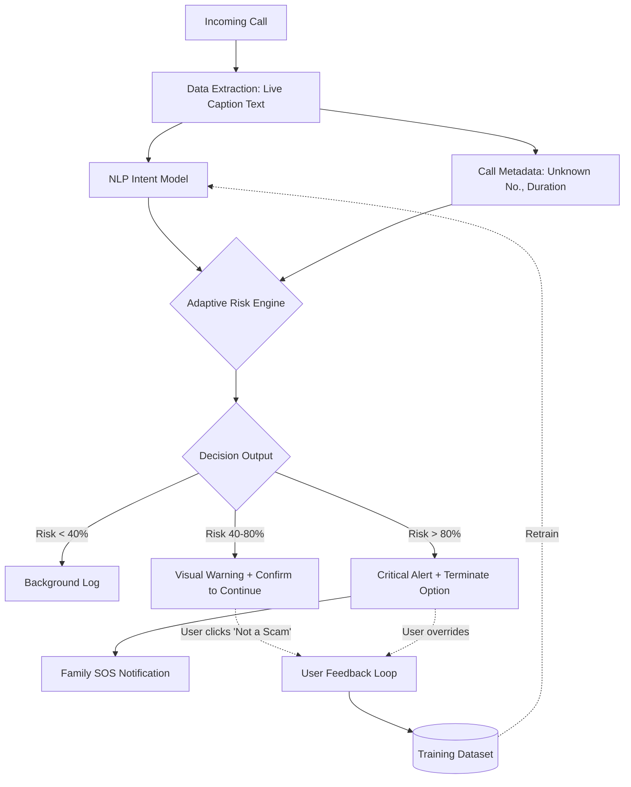

# VoiceGuard: Master Pitch Deck Assets
**เอกสารเตรียมข้อมูลสำหรับทำสไลด์นำเสนอ (Final Pitch Version)**

---

## 1. "Why Now?" (ทำไมต้องทำเดี๋ยวนี้)
*   **The 40-Billion Baht Problem:** สถิติจากตำรวจไซเบอร์ (ปี 2566-2567) มีคดีหลอกลวงออนไลน์กว่า 3 แสนคดี **มูลค่าความเสียหายสูงถึง 3-4 หมื่นล้านบาท** และเป้าหมายหลักที่สูญเสียเงินต่อหัวสูงสุดคือ "ผู้สูงอายุ"
*   **Generative AI Weaponization:** แก๊งคอลเซ็นเตอร์เริ่มใช้ AI Voice Clone และ Automated Scripts ทำให้การหลอกลวงแนบเนียนขึ้นและขยายสเกลได้เร็วขึ้น
*   **Targeted Elder Exploitation:** ผู้สูงอายุชาวไทยมีอัตราการใช้สมาร์ทโฟนสูงขึ้นมาก (Digital Adoption) แต่ยังมี Digital Literacy ต่ำ ทำให้ตกเป็นเป้าหมายที่โจมตีง่ายที่สุด

---

## 2. System Architecture & Data Flow
*(แผนภาพแสดงการไหลของข้อมูลและ Adaptive Risk Engine)*

*(อธิบายเพิ่มเติม: Adaptive Risk Engine จะไม่ใช้แค่ Rule-based แต่เป็นโมเดลที่เรียนรู้จาก Feedback ของผู้ใช้ (Human-in-the-loop) หาก AI เตือนผิดและผู้ใช้กดยืนยันว่าปลอดภัย ข้อมูลจะถูกนำไปปรับ Weight ของโมเดลให้แม่นยำขึ้น)*

---

## 3. Competitor Matrix (ตารางเปรียบเทียบคู่แข่ง)

| ฟีเจอร์ / ผลิตภัณฑ์ | VoiceGuard | Truecaller / Whoscall | Google Call Screen | Status Quo (ไม่ลงแอปอะไรเลย) |
| :--- | :--- | :--- | :--- | :--- |
| **แนวทางการป้องกัน** | **Proactive (Content-based)** | Reactive (Blacklist) | Pre-screening (Assistant) | ไม่มี (อาศัยสติผู้สูงอายุ) |
| **จังหวะการช่วยเหลือ** | **ระหว่างสนทนา (During Call)** | ก่อนรับสาย (Before Call) | ก่อนรับสาย (Before Call) | โดนล้างสมองเต็มรูปแบบ |
| **จุดเน้น (Focus)** | สแกมหลอกโอนเงินแบบเจาะจง | จัดการสแปมทั่วไป | จัดการสายเรียกเข้าทั่วไป | ความเสี่ยงสูงสุด 100% |
| **ความเหมาะสมกับคนแก่** | **สูง (ทำงานอัตโนมัติเบื้องหลัง)** | ปานกลาง (ต้องอ่านหน้าจอ) | ต่ำ (คนแก่มักสับสนกับบอท) | ผู้สูงอายุรับสายเบอร์แปลกทุกสาย |

---

## 4. Defensibility & The Moat (ทำไมบริษัทใหญ่ถึงลอกยาก)
ถ้า Google จะทำฟีเจอร์นี้แข่งกับเรา ทำไมเราถึงยังรอด? นี่คือคูเมือง (Moat) ของเรา:
1.  **Thai Scam Intent Dataset:** เราครอบครองและเทรนโมเดลด้วยบริบทคำหลอกลวงของไทยโดยเฉพาะ (เช่น อ้างชื่อหน่วยงานไทย, มุกส่งพัสดุ, มุกคดีฟอกเงิน) ซึ่ง Google Global Model อาจไม่เข้าใจบริบทเชิงลึกเท่า Local AI
2.  **Insurance Partnership (B2B2C):** โอกาสในการผูกระบบเข้ากับบริษัทประกัน (OIC) เพื่อออกโปรดักต์ "ประกันไซเบอร์ผู้สูงอายุ" สร้าง Lock-in effect ที่คู่แข่งเข้ามาแทรกยาก
3.  **Family Trust Network:** แพลตฟอร์มเราไม่ได้เชื่อมแค่คนแก่กับ AI แต่ผูก "บัญชีลูกหลาน" เข้าไว้ด้วยกัน (SOS Alert) สร้าง Network Effect ภายในครอบครัว

---

## 5. Startup KPIs (ตัวชี้วัดความสำเร็จ 6 เดือนแรก)
เราไม่วัดแค่ยอดดาวน์โหลด แต่เราวัดประสิทธิภาพของโมเดล:
1.  **Detection Recall & Precision:** เป้าหมาย Precision >85% (ลด False Positive) ในชุดข้อมูลทดสอบ
2.  **Average Warning Time:** ระยะเวลาตั้งแต่รับสายจนถึง AI แจ้งเตือน (เป้าหมาย: ภายใน 30 วินาทีแรกของการสนทนา)
3.  **User Trust Score / Opt-out Rate:** อัตราการถอนการติดตั้งแอปหลังใช้งาน 30 วัน (เพื่อวัดว่า AI น่ารำคาญหรือมีประโยชน์)
4.  **Daily Protected Calls:** จำนวนสายแปลกหน้าที่ระบบได้ทำการประเมินความเสี่ยงต่อวัน

---

## 6. Realistic Roadmap (แผนการดำเนินงาน 6 เดือน)
*   **Month 1:** สร้าง Prototype ใช้งานได้จริงผ่านโหมด Protected Speaker (Android)
*   **Month 2:** Pilot Test กับกลุ่มตัวอย่าง (ครอบครัวนักศึกษา 50 ครอบครัว)
*   **Month 3:** ขยายฐานผู้ใช้งาน 500 Users แรก (Family Accounts)
*   **Month 4:** ประมวลผลและเรียนรู้จาก 10,000 การโทรแรก (Data Collection)
*   **Month 5:** ปรับปรุง Adaptive Risk Engine รุ่น 2.0 (ลด False Positive)
*   **Month 6:** นำผลลัพธ์ (Success Rate) ไปเสนอ Partnership กับบริษัทประกันและ Telco

---
*(**Appendix:** ฟีเจอร์ Micro-learning สำหรับ AIS จะถูกแทรกไว้ในหน้าจบการโทร (Post-call) เพื่อให้ความรู้ตามบริบทหลังจากที่ผู้ใช้ปลอดภัยแล้ว)*
